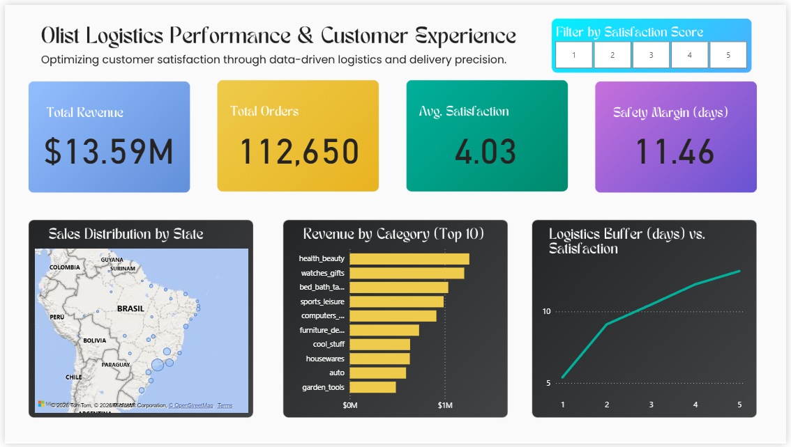

# ecommerce-customer-experience-analytics
📈 A data-driven approach to customer loyalty: Discovering how delivery precision impacts review scores in the Brazilian e-commerce market. Built with Python, SQL and Power BI.

# Olist Logistics Performance & Customer Experience Analysis

  

## 🎯 Project Overview
This project explores the relationship between logistics efficiency and customer satisfaction within the Brazilian e-commerce landscape. By analyzing over **100,000 orders** from the Olist dataset, I developed a high-fidelity dashboard to visualize how delivery performance directly impacts business health.

## 🚀 Key Insights & Findings
The core of this analysis centers on the **'Safety Margin'** (the difference in days between the estimated delivery date and the actual delivery date).

* **Logistics Sensitivity Analysis:** I identified a "Critical Buffer Zone." Satisfaction stays low and volatile when the margin is below 5 days, but stabilizes at its peak (**4.5+ stars**) once the **Safety Margin exceeds 10 days**.
* Logistics as a CX Driver: Customer dissatisfaction is triggered not just by "late" deliveries, but by the erosion of the promised delivery window. When the safety margin falls below 1 day (approaching the estimated date), review scores begin to drop significantly, indicating that customers value the "buffer" as much as the delivery itself.
* **Revenue Concentration:** The Top 10 product categories (led by Health & Beauty and Watches) account for a significant portion of the $13.59M total revenue, highlighting where logistics optimization has the highest financial impact.

## 🛠️ Tech Stack
* **Python (Pandas):** Data cleaning, ETL, and feature engineering for logistics metrics.
* **SQL:** Complex data joins and time-series calculations.
* **Power BI:** * **DAX:** Implementation of custom measures for Average Satisfaction and Safety Margins.
    * **UI/UX:** Advanced dashboard design using custom gradients and a strategic visual hierarchy.

## 💡 Strategic Recommendations
1.  **Buffer Protection:** Implement an automated alert system when the predicted safety margin for an order falls below 5 days.
2.  **Expectation Management:** Recalibrate the delivery estimation algorithm for states with high logistics volatility to maintain a perceived "Safety Zone" for the customer.
3.  **Category-Specific Logistics:** Prioritize "Express" shipping for high-revenue categories to stabilize the overall platform NPS.

---
**Author:** David Picazo  
**Field:** Clinical Efficiency Specialist | Data Analyst  
**Contact:** [da.picazo@gmail.com](mailto:da.picazo@gmail.com)
